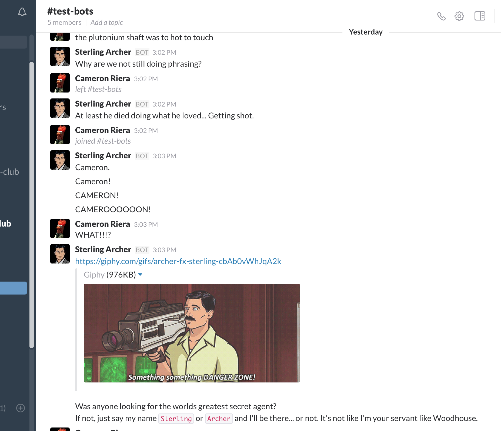

# SlackbotArcher


The Slackbot Archer comes equipped with his famous DANGER ZONE diatribe when someone joins a channel or group.
He also does phrasing, and "Can't or Won't?". Mention his name and see what he does!



## Running the SlackbotArcher

To run SlackbotArcher you must have an [API token(#getting-the-api-token-for-your-slack-channel) to authenticate the bot on your slack channel.
Once you get it (instructions on the next paragraph) you just have to run:

```bash
BOT_API_KEY=secretapikey archerbot
```

## Getting the API token for your Slack channel

To allow the SlackbotArcher to connect your Slack channel you must provide him an API key. To retrieve it you need to add a new Bot in your Slack organization by visiting the following url: https://*yourorganization*.slack.com/services/new/bot, where *yourorganization* must be substituted with the name of your organization (e.g. https://*loige*.slack.com/services/new/bot). Ensure you are logged to your Slack organization in your browser and you have the admin rights to add a new bot.

You will find your API key under the field API Token, copy it in a safe place and get ready to use it.

## Configuration

The SlackbotArcher is configurable through environment variables. There are several variable available:

| Environment variable | Description |
|----------------------|-------------|
| `BOT_API_KEY` | this variable is mandatory and must be used to specify the API token needed by the bot to connect to your Slack organization |
| `BOT_NAME` | the name of your bot, it’s optional and it will default to archer |

## Launching the bot from source

If you downloaded the source code of the bot you can run it using NPM with:

```bash
$ npm start
```

Don't forget to set your `BOT_API_KEY` environment variable bedore doing so. Alternatively you can also create a file called `token.js` in the root folder and put your token there (you can use the `token.js.example` file as a reference).

[](https://heroku.com/deploy)
